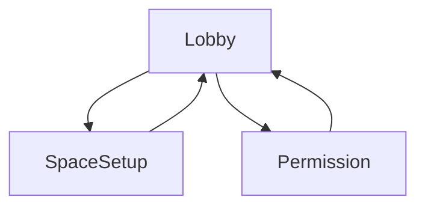
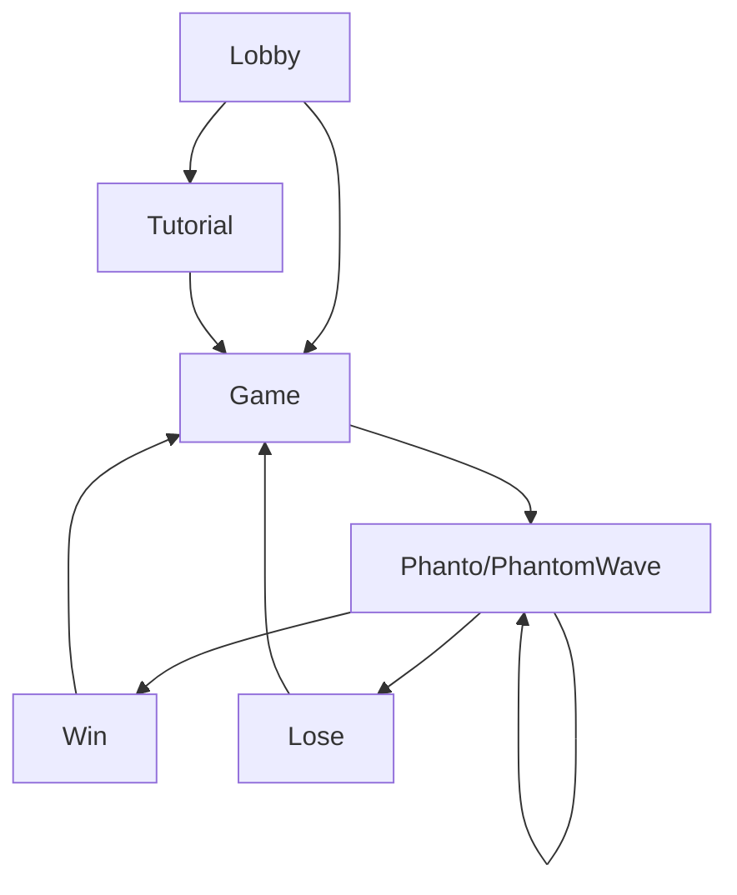
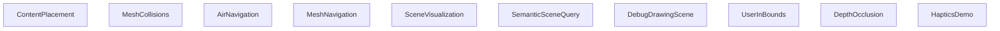

# Design Flow

The following diagrams represent the game's main user flow.

## Setup Design

Before starting the game, the setup flow will verify that the user has:

- Completed **Space Setup** and has a Scene Model
- Granted **Spatial Data** permission ([implementation instructions](https://developers.meta.com/horizon/documentation/unity/unity-spatial-data-perm/))

Without these two requirements, the application can't function. Therefore, the user will only be able to advance to the next scene after complying with these requirements.

When permission is denied, or if no Scene Model is present, the user will be presented with prompts that allow them to rescan their room and grant permissions.

|                      Missing scene prompt                       |                           Permission prompt                           |
| :-------------------------------------------------------------: | :-------------------------------------------------------------------: |
|  |  |

## Gameplay Design

The following diagram shows the high-level states for the player after they have fulfilled the requirements above. When launching the game for the first time, the player will go through a tutorial. Afterward, the tutorial can be skipped. During gameplay, the player will go through several waves:

1. **Phanto Wave** - requires the player to spray Phanto using the Polterblast 3000 while keeping goo levels low.
2. **Phantom Wave** - requires the player to protect the green crystal by placing the EctoBlaster in strategic locations using both controllers.

## Developer Examples

These example scenes are available for developers. They showcase best practices with each of the Presence Platform components.

