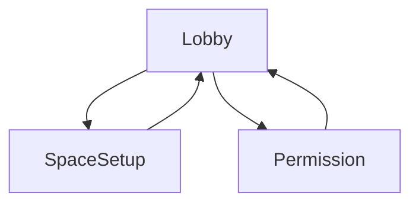
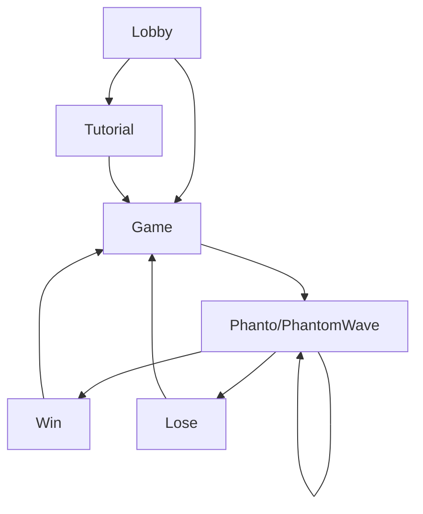
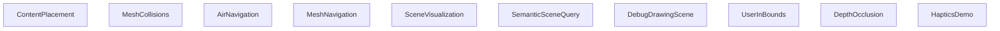

# Project Phanto - Presence Platform Reference App

# Project overview

Project Phanto is a Unity reference app, showcasing the latest Presence Platform
features, highlighting scene mesh, Scene Model, and Scene API objects

The
[scene mesh](https://developer.oculus.com/documentation/unity/scene-best-practices/)
is a low-fidelity, high-coverage artifact which describes the boundary between
free and occupied space in a room. It is generated automatically during the
Space Setup experience, and available for applications to query via Scene API.

The haptic assets used in this project have been designed with
[Haptics Studio](https://developer.oculus.com/documentation/unity/haptics-studio/),
and were integrated using the
[Haptics SDK for Unity](https://developer.oculus.com/documentation/unity/unity-haptics-sdk/)
following our
[Haptic Design Guidelines](https://developer.oculus.com/resources/haptics-design-guidelines/).

## Requirements

- Recommended Unity version: 2022.3.20f1
- Mac or Windows
- Unity OVR Integration package v64 (included in the project)

  

# Table of Contents

1. [Project overview](#project-overview)
2. [Health and safety guidelines](#health-and-safety-guidelines)
3. [Design flow](#design-flow)
4. [Device compatibility](#device-compatibility)
5. [Key components](#key-components)
6. [Getting started](#getting-started)
7. [Running the project](#running-the-project)
8. [Main Scenes](#main-scenes-1)
9. [Example scenes](#example-scenes-1)
10. [Dependencies](#dependencies)
11. [License](#license)

  

# Health and safety guidelines

When building mixed reality experiences, we highly recommend evaluating your
content from a health and safety perspective to offer your users a comfortable
and safe experience. Please read the
[Mixed Reality H&S Guidelines](https://developer.oculus.com/resources/mr-health-safety-guideline/)
before designing and developing your app using this sample project, or any of
our Presence Platform features.

Developers should avoid improper occlusion, which occurs when virtual content
does not respect the physicality of the user’s environment. Improper Occlusion
can result in a misperception of actionable space.

- See
  [Occlusions with Virtual Content](https://developer.oculus.com/resources/mr-health-safety-guideline/#passthrough)

- To avoid improper occlusion, developers should ensure that users have (1)
  completed Space Setup and (2) granted Spatial Data permission (setup design)
  to allow proper occlusion in content placement, mesh collisions, and air
  navigation.

Using semi-transparent content lets the user have a better view of their
physical space and reduces the occlusion of objects or people that are not part
of the scanned mesh.

- Spatial data won’t incorporate dynamic elements of a user’s living space (for
  example, a chair that was moved after capture or a moving person/pet in the
  space).

- Uncaptured dynamic elements may be occluded by virtual content, making it more
  difficult for a user to safely avoid such hazards while engaged in the mixed
  reality experience.

Respect the user’s personal space. Avoid having virtual content pass through
their body or loom close to their face. When content crosses into a user’s
personal space they may experience a psychological or visual discomfort, or take
actions to avoid the virtual content that may increase the risk of injury or
damage (for example, backing up into a wall or chair). Dynamic virtual content
may also distract the user from their surroundings.

- [PersonalBubble.cs](./Assets/Phanto/Player/PersonalBubble.cs) is an example of
  how to implement a "personal bubble" as part of the nav mesh. Add this script
  to the player camera rig to prevent Phanto from getting too close to it.
- The circumference of the ‘personal bubble’ may be altered to provide more
  space. The faster that virtual content approaches a user, the larger
  the circumference may need to be tuned.

  

# Design flow

The following diagrams represent the game's main user flow.   

## Setup design

Prior to starting the game, the setup flow will verify the user has:

- Completed **Space Setup** and has a Scene Model
- Granted **Spatial Data** permission
  ([implementation instructions](https://developer.oculus.com/documentation/unity/unity-spatial-data-perm/))

Without these two requirements, the application can't function. Therefore, the
user will only be able to advance to the next scene after complying with these
requirements.

When permission is denied, or if no Scene Model is present, the user will be
presented with prompts that allow them to rescan their room and grant
permissions.

|                      Missing scene prompt                       |                           Permission prompt                           |
| :-------------------------------------------------------------: | :-------------------------------------------------------------------: |
|  |  |

  

## Gameplay design

The following diagram shows the high-level states for the player after they have
fulfilled the requirements above. When launching the game for the first time,
the player will go through a tutorial. Afterward, the tutorial can be skipped.
During gameplay, the player will go through several waves, which can be either:
1. Phanto Wave - requires the player to spray Phanto using the Polterblast 3000 while keeping goo levels low.
2. Phantom Wave - requires the player to protect the green crystal by placing the EctoBlaster in strategic locations using both controllers.

  

## Developer examples

These example scenes are available for developers. They showcase best practices
with each of the Presence Platform components.

There is more information on the [example scenes below](#example-scenes).

  

# Device Compatibility

| Device    | Scene API | Color Passthrough | High res color | Scene Mesh | Haptics[1](#HapticsQuality) |
| :-------- | :-------: | :---------------: | :------------: | :--------: | :------------------------------------: |
| Quest 3   |    ✔️     |        ✔️         |       ✔️       |     ✔️     |                   ✔️                   |
| Quest Pro |    ✔️     |        ✔️         |       ❌       |     ❌     |                   ✔️                   |
| Quest 2   |    ✔️     |        ❌         |       ❌       |     ❌     |                   ✔️                   |

 

<a name="HapticsQuality">1</a>: There have been significant improvements in the
haptics capability of Quest Pro and Quest 3 controllers over Quest 2: Quest Pro
and Quest 3 introduce TruTouch haptics, enabling a new level of immersion in
your applications. For more information, visit our
[Haptic Design Guidelines](https://developer.oculus.com/resources/haptics-design-guidelines/#meta-quest-platform-and-haptic-hardware-considerations).

 

# Key components

The game demonstrates our recommended best practices when using the new scene
mesh feature and updated Scene API.

 

## The Scene Mesh

The scene mesh is provided in the project and is accessed using
**OVRSceneManager**. Each one of the sample scenes will create an
**OVRSceneManager** component and automatically load the mesh and room elements
captured during the space setup flow. The scene mesh will be represented as a
standard Unity mesh. It can contain a collider, and will respond to ray casts.
In the project, the scene mesh will be assigned the **GlobalMesh** layer mask.

For more information on how to get started with scene mesh, visit
[Meta Quest Developer Portal](https://developer.oculus.com/documentation/unity/scene-best-practices/).

  

## The Ectofluid (Ghostly Goo)

The Ectofluid is a ghostly goo, created both by Phanto and their Phantoms.
Beware: once your room gets too covered with goo, you lose the game.

This element demonstrates the ability to place virtual content onto the physical
environment represented by the scene mesh. With this new ability, content can be
attached anywhere within the room reconstruction, adjusting itself to the real
physical environment.

  

## The Polterblast 3000

This element demonstrates the use of the scene mesh as a physics component. This
allows the fluid to collide with the mesh, and creates a splashing effect. We
recommend using particles with fast collisions to create a more immersive
experience.

- Use the Polterblast 3000 to throw Ectofluid and clean the ghostly goo from
  your room.
- Press the Right Trigger to throw Ectofluid   

## Phanto and the Phantoms

Watchout! Some Phantoms are appearing in your room. Use the Polterblast 3000
(RT) and the Ecto Blaster (LT) to defeat all of them.

- Phanto is an air-navigated NPC that uses the scene mesh as a sensor to figure
  out available places, both to navigate to, and to spawn virtual elements onto
  (Ectofluid).
- The Phantoms are small, ground-navigated NPCs that use both the scene mesh and
  the room capture data (chairs, couch, desk, windows, etc.) to navigate across
  the environment, jump to targeted places, and spawn content (Ectofluid).

  

## Ecto Blaster

The Ecto Blaster allows you to defeat the Phantoms. Place it in your room, and
it will target and throw Ectofluid at them. To place the Ecto Blaster, point to
any location in your room and press the Left Trigger. This element demonstrates
the ability to trace and ray cast against the environment, using the scene mesh
as a ray cast layer. This allows the user to create and place virtual content in
mixed reality that responds to the scene.

  

# Getting started

## Prerequisites

1. Clone the project using:
   `git clone https://github.com/oculus-samples/Unity-Phanto`
2. Recommended Unity version - 2022.3.20f1.

## Using the project's scenes

After opening the project, you will find three main scenes and nine example
scenes:

### Main Scenes

1. [LobbyScene.unity](Assets/Phanto/Scenes/LobbyScene.unity): this
   self-contained scene contains the introduction scene, showing the current
   mesh, and allows the player to start the game.
2. [TutorialScene.unity](Assets/Phanto/Scenes/TutorialScene.unity): contains the
   tutorial for the player, presenting the controls and game dynamics.
3. [GameScene.unity](Assets/Phanto/Scenes/GameScene.unity): this self-contained
   scene contains the assets for the actual gameplay. This includes Phanto, the
   Phantoms, and other assets.

### Example Scenes

1. [ContentPlacement.unity](Assets/Phanto/Scenes/Features/ContentPlacement.unity):
   contains an example that uses the mesh for content placement. The example
   takes the Blaster from the game and demonstrates how to use the mesh to place
   it anywhere in the room.
2. [MeshCollisions.unity](Assets/Phanto/Scenes/Features/MeshCollisions.unity):
   demonstrates using the mesh for physics. Using fast collisions, the
   recommended way, the Ectoplasma bounces off the mesh and creates a realistic
   experience.
3. [AirNavigation.unity](Assets/Phanto/Scenes/Features/AirNavigation.unity):
   demonstrates how to use the scanned mesh as a sensor for an air-navigated
   character (Phanto).
4. [MeshNavigation.unity](Assets/Phanto/Scenes/Features/MeshNavigation.unity):
   demonstrates how to use the mesh for ground navigation, with and without
   additional bounding box information on the furniture (acquired using manual
   capture of the room elements).
5. [SceneVisualization](Assets/Phanto/Scenes/Features/SceneVisualization.unity):
   a debug scene that presents the mesh and the furniture bounding box, if
   available.
6. [SemanticSceneQuery](Assets/Phanto/Scenes/Features/SemanticSceneQuery.unity): showcases phantom wave logic, allowing phantoms to navigate to furniture and attack crysals.
7. [DebugDrawingScene](Assets/Phanto/Scenes/Features/DebugDrawingScene.unity): a
   debug scene that showcases some of the developer debug tools.
8. [UserInBounds](Assets/Phanto/Scenes/Features/UserInBounds.unity): shows the
recommended way of handling player notifications when they are leaving the scene bounds.
9. [DepthOcclusion](Assets/Phanto/Scenes/Features/DepthOcclusion.unity): demonstrates the use of soft and hard dynamic occlusions implemented using the [Depth API](https://developer.oculus.com/experimental/scene-depth-unity/)
10. [HapticsDemo](Assets/Phanto/Scenes/Features/HapticsDemo.unity): showcases the
   integration of haptics with dynamic modulation tied to controller
   interactions and virtual objects.

  

# Running the project:

In general, all scene data (both in headset and in Editor) is managed by the
[**SceneDataLoader.cs**](Assets/Phanto/Environment/Scripts/SceneDataLoader.cs)
script, interacting with the **OVRSceneManager** prefabs:

There are three options for running the project.

## Using a Quest 3

Build, deploy, and run the game on your headset.

## Using Oculus Link (Only on Windows):

1. Open the Oculus app.
1. Run Oculus Link from the headset.
1. Run Unity using the **Play** button. Make sure you select **Scene Api** as
   the **Scene Data Source** in the
   [**SceneDataLoaderSettings.asset**](Assets/Phanto/SceneDataLoaderSettings.asset)
   scriptable object:

   

**\*NOTE**: Scene mesh and room elements will show up in Link. However, you can
only trigger room scan from within the headset. Please do it beforehand.\*

## Using static mesh

This option will load a pre-scanned mesh in-editor, or in the headset. This
allows development without a Scene Model on the headset.

To enable this, you need to select **Static Mesh Data** as the **Scene Data
Source** in the
[**SceneDataLoaderSettings.asset**](Assets/Phanto/SceneDataLoaderSettings.asset)
scriptable object:

If you are on Windows, enable
[XR Simulator](https://developer.oculus.com/documentation/unity/xrsim-intro/),
and press **Play**.

  

# Main scenes

## LobbyScene

This scene functions as an introductory scene for the player. The player can
view their scene, scan it, and change it. If no scene information is provided,
the player will be guided to the **Space Setup** flow. If there is scene
information for the current environment, the player can advance to one of these
three options:

1. [TutorialScene](#TutorialScene): starts the tutorial for the player.
2. [GameScene](#GameScene): starts the game for the player.
3. Trigger **Space Setup**: using the left trigger, the player can restart the
   **Space Setup** process, allowing them to rescan the environment in case
   something has changed.

|                      Rescan Scene                      |                     Start Game                     |
| :----------------------------------------------------: | :------------------------------------------------: |
|  |  |

  

## TutorialScene

The tutorial scene introduces the player to game mechanics. In this scene, the
player will learn how to:

- Use the Polterblast 3000.
- Fight Phanto
- Place the Ecto Blaster.
- Shoot and interact with Phantoms.

When running the app for the first time, the tutorial is mandatory. Afterward,
the player will have the option to repeat the tutorial, or jump right into the
game.

In this scene, you can find examples of how some subcomponents (excluding
Phanto) are used in the game. In addition, a set of controller-locked UI screens
can be found here. As with other scenes, the tutorial scene also uses the scene
mesh and scene elements, managed by the **SceneDataLoader** component.

|                     Welcome                     |                     Polterblast                     |                   Goo                   |                  Ecto Blaster                   |                    Phantoms                     |                   Start Game                    |
| :---------------------------------------------: | :---------------------------------------------: | :---------------------------------------------: | :---------------------------------------------: | :---------------------------------------------: | :---------------------------------------------: |
| |  |  |  |  |  |

  

## GameScene

This scene includes prefabs for the main game components:

- Phanto
- Phantoms
- Polterblast 3000
- Ecto Blaster

You can use the scene in standalone mode and run it using Oculus Link, or by
building and deploying it to your device.

All the game components are present in this scene, and restarting the game is as
simple as reloading the scene. In addition, you can find debug features within
the scene, that can be enabled using the **Menu** button on the left controller.

Within the scene, you can find the **SceneDataLoader** component, which takes
care of loading the mesh and scene information. Other components in the scene
are used to manage sound, GUI alerts, runtime assets, and game events.

|                          Object Placement                           |                                AI Navigation                                 |
| :-----------------------------------------------------------------: | :--------------------------------------------------------------------------: |
|  |  |

  

# Example scenes

## ContentPlacement

[ContentPlacement.unity](Assets/Phanto/Scenes/Features/ContentPlacement.unity)
contains an example that uses the mesh for content placement. The example takes
the Blaster from the game and shows how to use the mesh to place it anywhere in
the room.

  

## Mesh Collisions

[MeshCollisions.unity](Assets/Phanto/Scenes/Features/MeshCollisions.unity)
demonstrates using the mesh for physics. Using fast collisions, the recommended
way, the Ectoplasma bounces off the mesh and creates a much realistic
experience.

  

## Air Navigation

[AirNavigation.unity](Assets/Phanto/Scenes/Features/AirNavigation.unity) shows
how to use the scanned mesh as a sensor for an air navigated character (Phanto).

  

## Mesh Navigation

[MeshNavigation.unity](Assets/Phanto/Scenes/Features/MeshNavigation.unity) shows
how to use the mesh for ground navigation, with and without additional bounding
box information on the furniture (acquired using manual capture of the room
elements).

  

## Scene Visualization

[SceneVisualization.unity](Assets/Phanto/Scenes/Features/SceneVisualization.unity)
is a debug scene that presents the mesh and the furniture bounding box, if
available.

  

## Semantic Scene Query

[SemanticSceneQuery.unity](Assets/Phanto/Scenes/Features/SemanticSceneQuery.unity)
Demonstrates how to properly use the furniture that can be automatically discovered in the scene. The phantoms are using the Scene Mesh by spawning, targeting, navigating, and attacking crystals. In addition, the phantoms' thought bubble makes the game more immersive and compelling, allowing advanced path planning based on the automatically detected furniture.
  

## Debug Drawing Scene

[DebugDrawingScene.unity](Assets/Phanto/Scenes/Features/DebugDrawingScene.unity)
is a debug scene that showcases some of the developer debug tools.

  

## User In Bounds

[UserInBounds.unity](Assets/Phanto/Scenes/Features/UserInBounds.unity)
demonstrates best practices for the app to handle cases in which the user is
outside the scene. When leaving the scene bounds, the user should be notified
and presented with an option to rescan the space.
[InsideSceneChecker.cs](Assets/Phanto/Samples/Scripts/InsideSceneChecker.cs) is
attached to the camera prefab and notifies the app when either the user's head or
hands is inside/outside the bounds, using
[SceneBoundsChecker.cs](Assets/Phanto/Environment/Scripts/SceneBoundsChecker.cs)

  

## Depth Occlusion

[DepthOcclusion.unity](Assets/Phanto/Scenes/Features/DepthOcclusion.unity)
demonstrates best practices for dynamic occlusion using the [Depth API](https://developer.oculus.com/experimental/scene-depth-unity/) which uses real-time depth estimation for occlusions. To mitigate performance impact, a mixture of soft and hard occlusions were selected for each element in the game. Visit the [Depth API open-source repository](https://github.com/oculus-samples/Unity-DepthAPI) to learn more and try the new SDK.

  

## Haptics Demo

[HapticsDemo.unity](Assets/Phanto/Scenes/Features/HapticsDemo.unity) showcases
the integration of haptics with dynamic modulation tied to controller
interactions and virtual objects: Phanto is floating in the middle of the room
and will trigger a synchronized audio-haptic effect when "poked". Pulling the
trigger of the right controller will increase the amplitude of the effect, while
moving the thumbstick will modulate the frequency.

The haptic assets used in this project have been designed with
[Haptics Studio](https://developer.oculus.com/documentation/unity/haptics-studio/),
and were integrated using the
[Haptics SDK for Unity](https://developer.oculus.com/documentation/unity/unity-haptics-sdk/)
following our
[Haptic Design Guidelines](https://developer.oculus.com/resources/haptics-design-guidelines/).

To learn more about the Haptics SDK for Unity, and how dynamically modulated
haptics were implemented, check out
[HapticsDemoController.cs](Assets/Phanto/Samples/Scripts/HapticsDemoController.cs)
for the demo scene, or
[PolterblastTrigger.cs](Assets/Phanto/Polterblast/Scripts/PolterblastTrigger.cs)
for the Polterblast haptics featured in the main game loop!

  

# Dependencies

This project makes use of the following plugins and software:

- [XRGizmos](https://github.com/darktable/XRGizmos.git)
- [Graphy](https://github.com/Tayx94/graphy.git)

# License

This codebase is available as both a reference and a template for mixed reality
projects. The [Oculus License](./LICENSE.txt) applies to the SDK and supporting
material. The MIT License applies to only certain, clearly marked documents. If
an individual file does not indicate which license it is subject to, then the
Oculus License applies.

[XRGizmos](https://github.com/darktable/XRGizmos.git) sourced from
https://github.com/darktable/XRGizmos.git. The License for XRGizmos can be found
in [here](https://github.com/darktable/XRGizmos/blob/main/LICENSE.txt).

[Graphy](https://github.com/Tayx94/graphy.git) sourced from
https://github.com/Tayx94/graphy.git. The License for Graphy can be found in
[here](https://github.com/Tayx94/graphy/blob/master/LICENSE).

See the [CONTRIBUTING](./CONTRIBUTING.md) file for how to help out.

  
